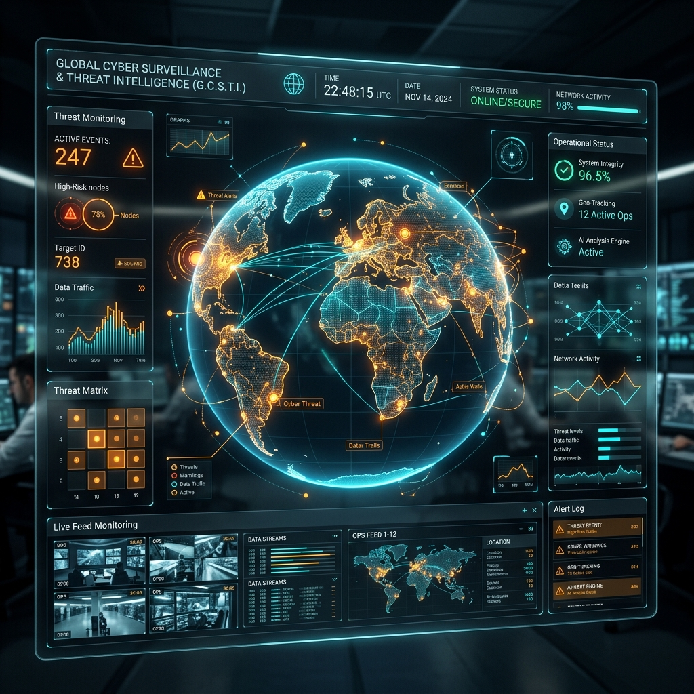

# 🌐 Global News AI | World Monitor HUD

<div align="center">
  
  <br>
  <b>Advanced Situational Awareness Command Center</b>
  <br>
  <i>Real-time intelligence surveillance for the modern age.</i>
  <br><br>

  [](https://opensource.org/licenses/MIT)
  [](#technical-stack)
  [](#intelligence--ai)
  []()
</div>

---

## 📽️ Project Overview

**Global News AI** is a high-tech, interactive "Command Center" intelligence dashboard. It is designed to provide real-time surveillance of global geopolitical conflicts, cyber security threats, climate anomalies, airline intelligence, and financial market volatility. 

The interface mimics a military-grade **Spec Ops HUD (Heads-Up Display)** with a dark-mode, glassmorphism aesthetic overlaid on a global satellite map.

## 🚀 Key Features

### 🌍 Global Situational Awareness
*   **Kinetic Zones (War Monitoring):** Real-time tracking of active conflict zones (Ukraine, Gaza/Israel, etc.).
*   **Tactical Map Views:** Interactive 2D/3D map toggle with situational regional monitoring.
*   **Map Legend & DEFCON Levels:** Visual decoding of threat levels and regional risks.

### 🛡️ Cyber & Technical Intelligence
*   **Sentinel-7 AI Analysis:** Powered by Llama 3.3-70B via Groq Cloud for deep-dive intelligence reports.
*   **Live Cyber Threat Feed:** Real-time IP-level threat intelligence integrated from MalwareBazaar and Abuse.ch.

### 📈 Financial & Market Surveillance
*   **Market Giants Matrix:** Live surveillance of tech market leaders and global economic institutions.
*   **Commodities & Logistics:** Tracking of metals (COMEX) and maritime logistics (Maersk, Hapag-Lloyd).
*   **Autonomous Harvesters:** Background sync for unicorns, startups, and insurance risk data.

### 📡 Satellite Downlink
*   **Multi-Live Stream Matrix:** 6+ simultaneous live news broadcasts from global outlets (Al Jazeera, DW, Sky News) integrated via YouTube IFrame API.
*   **Live News Ticker:** Constant feed of global news bulletins ingested into a MongoDB storage system.

---

## 🛠️ Technical Stack

### Frontend
- **Framework:** React.js + Vite
- **Visuals:** `react-globe.gl` & `Three.js` (3D Globe), `Leaflet` (2D Map)
- **Styling:** Vanilla CSS3 (Glassmorphism, Tactical Neon Aesthetics)
- **State/Data:** Axios, React Router

### Backend
- **Runtime:** Node.js + Express.js
- **Database:** MongoDB & Mongoose
- **Intelligence:** Groq Cloud API (Llama 3.3-70B)
- **Scraping:** Cheerio (Google Finance, COMEX)
- **Cache:** Custom Intel Cache Layer (3-minute TTL)

---

## ⚙️ Installation & Setup

### Prerequisites
- Node.js (v16+)
- MongoDB (Running locally or MongoDB Atlas)
- API Keys for: Groq Cloud, GNews, OpenSky (Optional)

### 1. Clone the Repository
```bash
git clone https://github.com/Himanshuy1/Mini-Project-6th-Sem.git
cd global-news-ai
```

### 2. Backend Configuration
```bash
cd backend
npm install
# Create a .env file based on .env.example
npm run dev
```

### 3. Frontend Configuration
```bash
cd ../frontend
npm install
npm run dev
```

---

## 🧠 Intelligence & AI: SENTINEL-7

The system's core intelligence, **SENTINEL-7**, performs concurrent data gathering and analysis. It combines real-time API data (weather, aviation, finance) with LLM-driven narrative generation to provide a comprehensive tactical overview of any global event.

---

## 📄 License

This project is licensed under the MIT License - see the [LICENSE](LICENSE) file for details.

Developed as a **6th Semester Mini-Project** by [Himanshu](https://github.com/Himanshuy1).
